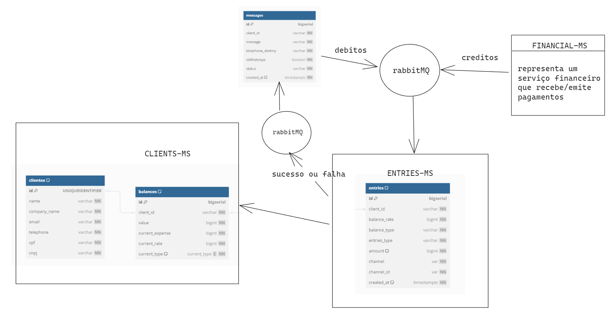
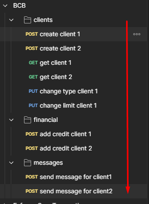

# BCB PROJECT
repositorios:

https://github.com/WellingtonDefassio/clients-ms
https://github.com/WellingtonDefassio/financial-ms
https://github.com/WellingtonDefassio/messages-ms
https://github.com/WellingtonDefassio/entries-ms

para startar o projeto basta executar o comando:

```bash
docker-compose up
```

### Downalod Collection Postman
[BCB.postman_collection.json](..%2F..%2FBCB.postman_collection.json)

### Estrutura do projeto



### Sobre os endpoints

deixei estruturado pra o teste de cada uma das funcionalidades solicitadas no desafio


### algumas regras de negocio que assumi
###### - uma conta só pode trocar de tipo (POS ou PRE) quando seu saldo está zerado
###### - as entradas de valores acontecem apartir de um serviço financeiro, este não foi implementado totalmente, porem seria um projeto a evoluir.
